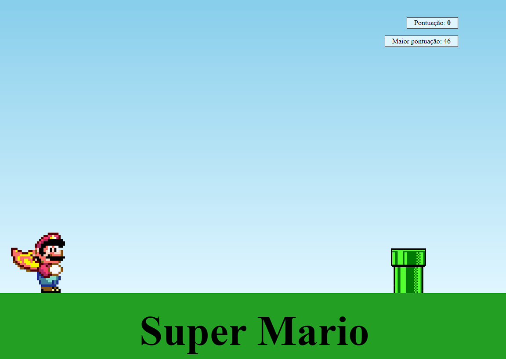
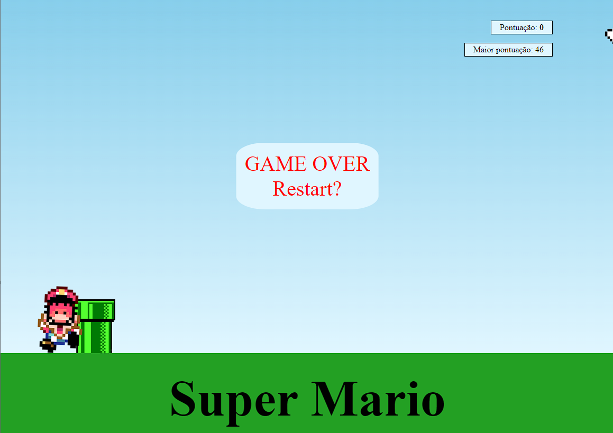

Um projeto simples e para praticar um pouco de html,css e javascript.

Onde seguindo o tutorial do canal 'Manual do Dev',
Link:
https://www.youtube.com/watch?v=r9buAwVBDhA&list=PLFie3VxXISbV3k9NPr-wXlk6CU4ypOIBt&index=82&ab_channel=ManualdoDev

Ao final do projeto adicionei um pouco mais de estilização com nome, uma caixa de mensagem de 'game over' onde aparece ao perder o game e uma pontuação, onde cada cano pulado aumenta de forma um pouco aleatoria dependendo da distancia que o personagem pulou, a maior pountuação tambem é salva no localStorage.

Para jogar é muito simples, basta apertar qualquer botão do teclado e desviar do cano.

Ideias para futuros updates.: aumentar a velocidade do jogo ao decorrer do tempo.
